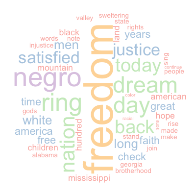

---
title       : Word Cloud Generator
subtitle    : Developing Data Products - Course Project
author      : Jun Quan THAM
framework   : io2012        # {io2012, html5slides, shower, dzslides, ...}
highlighter : highlight.js  # {highlight.js, prettify, highlight}
widgets     : []            # {mathjax, quiz, bootstrap}
hitheme     : tomorrow
mode        : selfcontained # {standalone, draft}
knit        : slidify::knit2slides
--- &twocol 

## Introduction

*** =left
<p style="font-size:24px; font-weight:bold; line-height:200%">What is a word cloud?</p>

<b>According to Wikipedia ...</b>
<p style="font-size:18px;">
A tag cloud, word cloud, or weighted list is a visual representation of text data, typically used to depict keyword metadata (tags) on websites, or to visualize free form text. Tags are usually single words, and the importance of each tag is shown with font size or color. This format is useful for quickly perceiving the most prominent terms and for locating a term alphabetically to determine its relative prominence. 
</p>

<p style="font-size:14px;">
Source: <a href='https://en.wikipedia.org/wiki/Tag_cloud'>https://en.wikipedia.org/wiki/Tag_cloud</a>
</p>

<p style="font-size:14px;font-style:italic">
Word Cloud Sample based on "I have a Dream" by Martin Luther King Jr
</p>
*** =right
<br><br>


--- &twocol

## What this Shiny Application does?

*** =left
<p style="font-size:24px; font-weight:bold; color:#336699; margin:10% 5% 10% 0%">
It helps you generate word clouds by doing all the heavy lifting for you!</p>

<p style="font-size:18px; margin:10% 5% 10% 0%"">
This application to help you generate word clouds from blocks of text. The application uses the tm package to perform a series of text mining tasks listed on the right.
<br><br>
Once the occurances of the individual words are returned, the wordcloud package is being used to plot the word cloud.
</p>

*** =right
<p style="font-size:24px; font-weight:bold; color:#336699; margin:10% 0% 10% 0%">
Text mining tasks performed ...<br><br></p>

<ol>
<li style="font-size:18px;">Convert the text to lower case </li>
<li style="font-size:18px;"> Remove all punctuations</li>
<li style="font-size:18px;"> Remove stop words based on the English language</li>
<li style="font-size:18px;"> Strip all extra white spaces</li>
<li style="font-size:18px;"> Construct a Document Term Matrix</li>
<li style="font-size:18px;"> Count the occurance of individual words</li>
</ol>

--- &twocol
## How Does It Work?
The key workings behind the Shiny application is illustrated here. The tm and wordcloud libraries are first loaded. 2 functions, getDocumentTermMatrix and getWordCloudInput were then created to process and get the frequency of words from the input text.

*** =left

```{r, warning=FALSE, message=FALSE}
library(tm)
library(wordcloud)

getDocumentTermMatrix <- function(input=NULL){
        # Reads the input and convert it to a Corpus
        textInput <- input
        processedText <- VectorSource(textInput)
        corpus <- Corpus(processedText)
        
        # Once converted, the tm_map function is used to transform
        # the content to lower case so that same words will be 
        # grouped together
        corpus <- tm_map(corpus,content_transformer(tolower))
        
        # Next punctuations and stop words from the SMART information
        # retrieval system are removed from the corpus
        corpus <- tm_map(corpus,removePunctuation)
        corpus <- tm_map(corpus,removeWords,stopwords("SMART"))
        
        # All extra white spaces are then removed and a document term
        # matrix is then returned
        corpus <- tm_map(corpus,stripWhitespace)
        dtmObj <- DocumentTermMatrix(corpus)
        dtm <- as.matrix(dtmObj)}
```

*** =right

```{r, warning=FALSE, message=FALSE}
getWordCloudInput <- function(dtm){
        # Reads the Document Term Matrix and sums up the 
        # frequency of words
        Frequency <- colSums(dtm)
        Text <- names(Frequency)
        
        # Convert the text and its frequency into a data frame and 
        # respective types (ie. Character and Numeric)
        df <- as.data.frame(cbind(Text,Frequency))
        df$Text<-as.character(df$Text)
        df$Frequency<-as.numeric(as.character(df$Frequency))
        rownames(df) <- NULL
        
        # Returns the data frame for use to plot a word cloud
        df}
```

--- &twocol

## How Does It Work? Cont ...
Using the functions defined earlier, we will try to plot a word cloud using the sample text "I have a Dream" by Martin Luther King Jr. In the Shiny application you will also be able to use your own text as well as to select from the various palettes available in RColorBrewer. You may click [here](https://junquant.shinyapps.io/dataproducts) to try the Shiny application.

For more information about the tm package click [here](https://cran.r-project.org/web/packages/tm/tm.pdf).<br>
For more information about the wordcloud package click [here](https://cran.r-project.org/web/packages/wordcloud/wordcloud.pdf).
*** =left
```{r, eval=FALSE, warning=FALSE}

# Load the sample text
ihaveadream <- readRDS("ihaveadream.RDS")

# Use the functions defined earlier to get the document term matrix
# and the data frame for the word cloud
dtm <- getDocumentTermMatrix(ihaveadream)
df <- getWordCloudInput(dtm)
df <- df[order(-df$Frequency,df$Text),]

# Define a palette from RColorBrewer to be used for the
# word cloud
palette <- brewer.pal(5,"YlOrRd")

# Plot the word cloud using the word cloud package
wordcloud(df$Text,df$Frequency, 
     scale=c(7,0.1), min.freq=1,
     max.words=50, random.order=FALSE, 
     rot.per=.15, colors=palette)

```

*** =right

```{r, echo=FALSE,eval=TRUE, warning=FALSE, fig.width=6,fig.height=5}

# Load the sample text
ihaveadream <- readRDS("ihaveadream.RDS")

# Use the functions defined earlier to get the document term matrix
# and the data frame for the word cloud
dtm <- getDocumentTermMatrix(ihaveadream)
df <- getWordCloudInput(dtm)
df <- df[order(-df$Frequency,df$Text),]

# Define a palette from RColorBrewer to be used for the
# word cloud
palette <- brewer.pal(5,"YlOrRd")

# Plot the word cloud using the word cloud package

wordcloud(df$Text,df$Frequency, 
     scale=c(6,0.1), min.freq=1,
     max.words=50, random.order=FALSE, 
     rot.per=.15, colors=palette)

```
